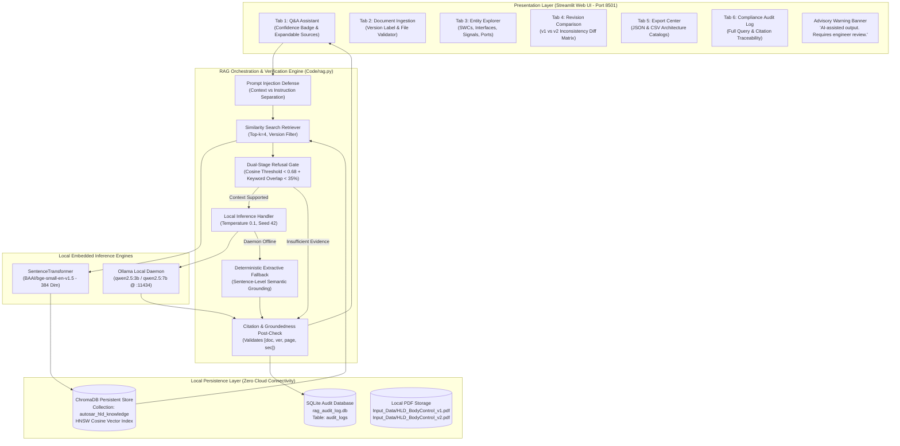
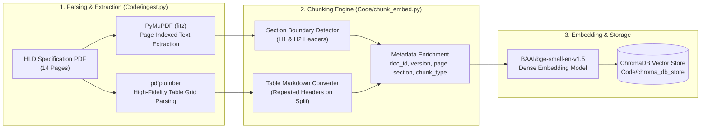
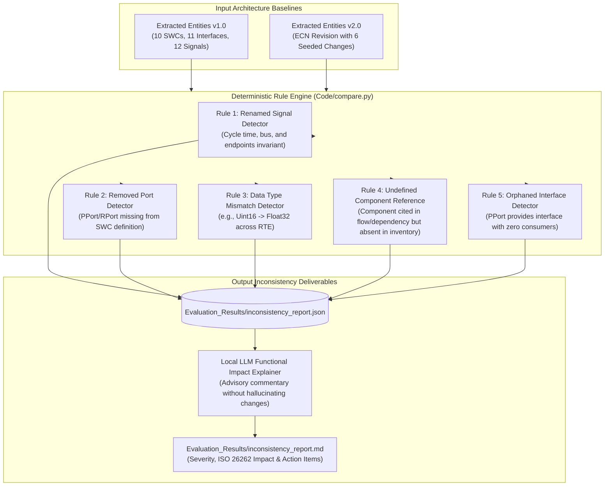

# AUTOSAR HLD Document Analysis Assistant: Architecture Specification

> **System Architecture & Dataflow Specification**  
> **Target Environment:** 100% Local / Offline Edge Execution (12 GB RAM, NVIDIA GeForce MX330 / CPU)  
> **Primary LLM:** Ollama `qwen2.5:3b` | **Dense Embeddings:** `BAAI/bge-small-en-v1.5`  

---

## 1. End-to-End System Architecture

The following diagram illustrates the interaction between the Streamlit user interface, the RAG orchestration pipeline, local vector/relational databases, and the offline inference components:

---

## 2. Ingestion & Section-Aware Chunking Pipeline

This pipeline transforms unstructured automotive PDF specifications into structured, searchable dense vector representations while preserving table layouts and hierarchical metadata:

---

## 3. Deterministic Architectural Revision Comparison Pipeline

To meet safety-critical ISO 26262 requirements, discrepancies between architectural revisions are detected strictly via deterministic rule evaluation, while the LLM is restricted solely to explaining engineering implications:

---

## 4. Hardware Sizing & Offline Execution Profile

- **RAM Footprint:** ~2.1 GB RSS (ChromaDB + SentenceTransformer + Streamlit daemon). Fits comfortably within 12 GB RAM budget.
- **VRAM Utilization:** 0 GB required (CPU inference for embeddings; Ollama CPU/GPU offload for `qwen2.5:3b`).
- **External Outbound Ports:** None. All communication occurs over `localhost:8501` (Streamlit HTTP) and `localhost:11434` (Ollama REST).
